# 工具

## 🛠️ 概述

好的工具能够大大提高学习和工作效率。在这个分组中，我分享了学习过程中使用的各种工具和技巧。

## 📝 LaTeX

LaTeX 是一个高质量的排版系统，特别适合包含复杂数学公式的文档。

### 基本语法

```latex
\documentclass{article}
\usepackage{amsmath}
\usepackage{amsfonts}

\begin{document}

\title{我的数学笔记}
\author{Alexander Xin}
\date{\today}
\maketitle

\section{微积分基础}

函数的导数定义为：
\begin{equation}
f'(x) = \lim_{h \to 0} \frac{f(x+h) - f(x)}{h}
\end{equation}

牛顿-莱布尼茨公式：
\begin{equation}
\int_a^b f(x) dx = F(b) - F(a)
\end{equation}

\end{document}
```

### 常用数学符号

| 功能 | LaTeX 代码 | 显示效果 |
|------|------------|----------|
| 分数 | `\frac{a}{b}` | $\frac{a}{b}$ |
| 根号 | `\sqrt{x}` | $\sqrt{x}$ |
| 积分 | `\int_a^b f(x) dx` | $\int_a^b f(x) dx$ |
| 求和 | `\sum_{i=1}^n x_i` | $\sum_{i=1}^n x_i$ |
| 极限 | `\lim_{x \to 0}` | $\lim_{x \to 0}$ |

## 🔧 Git

Git 是分布式版本控制系统，用于跟踪代码变更。

### 基本命令

```bash
# 初始化仓库
git init

# 添加文件到暂存区
git add .

# 提交变更
git commit -m "描述信息"

# 查看状态
git status

# 查看历史
git log --oneline

# 创建分支
git branch feature-name

# 切换分支
git checkout feature-name

# 合并分支
git merge feature-name
```

### 常用工作流

```mermaid
graph LR
    A[工作区] -->|git add| B[暂存区]
    B -->|git commit| C[本地仓库]
    C -->|git push| D[远程仓库]
```



## 💻 VS Code

VS Code 是轻量级但功能强大的代码编辑器。

### 推荐插件

- **Python**: Python 语言支持
- **Markdown All in One**: Markdown 编辑增强
- **LaTeX Workshop**: LaTeX 编译和预览
- **Git Graph**: 可视化 Git 历史
- **Prettier**: 代码格式化

### 快捷键

| 功能 | Windows | Mac |
|------|---------|-----|
| 命令面板 | `Ctrl+Shift+P` | `Cmd+Shift+P` |
| 文件搜索 | `Ctrl+P` | `Cmd+P` |
| 全局搜索 | `Ctrl+Shift+F` | `Cmd+Shift+F` |
| 集成终端 | `Ctrl+` | `Cmd+` |
| 侧边栏 | `Ctrl+B` | `Cmd+B` |

### settings.json 配置

```json
{
    "editor.fontSize": 14,
    "editor.tabSize": 4,
    "editor.wordWrap": "on",
    "python.defaultInterpreterPath": "python",
    "markdown.preview.fontSize": 14,
    "latex-workshop.view.pdf.viewer": "tab"
}
```

## 🌐 网站部署

### GitHub Pages

1. 在 GitHub 创建仓库
2. 开启 Pages 功能
3. 选择分支和文件夹
4. 访问生成的 URL

### Cloudflare Pages

1. 连接 GitHub 仓库
2. 配置构建设置
3. 部署完成后访问域名

### MkDocs 部署命令

```bash
# 安装 MkDocs
pip install mkdocs-material

# 预览网站
mkdocs serve

# 构建静态文件
mkdocs build

# 部署到 GitHub Pages
mkdocs gh-deploy
```

---

!!! tip "效率提升建议"
    - 学会使用快捷键
    - 定制个人工作环境
    - 使用版本控制管理所有项目
    - 定期备份重要数据